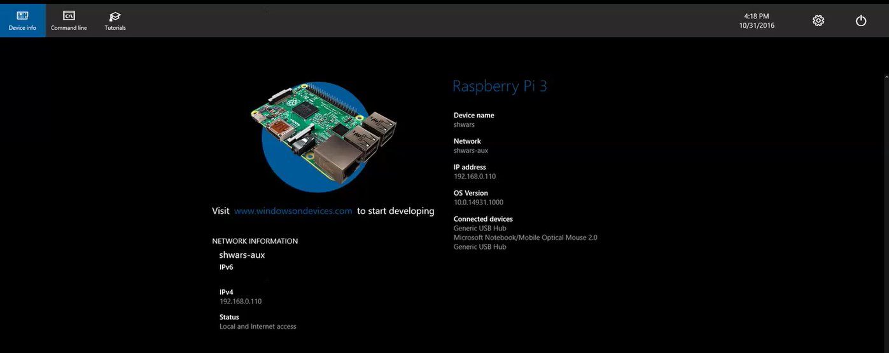
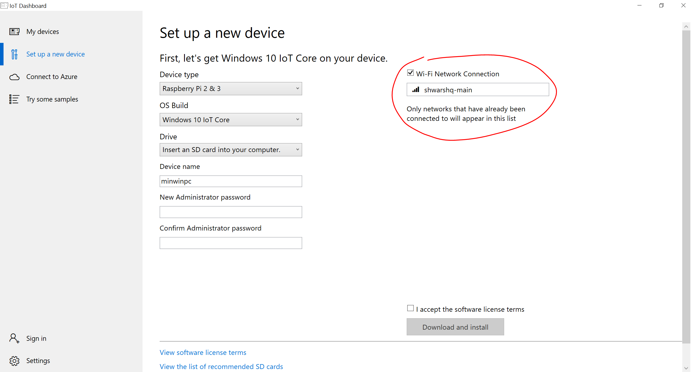

#DevCon School 2016: IoT-интенсив 

# Лабораторная 0: Настройка платы Raspberry Pi 2/3

## Подготовка карты MicroSD с образом Windows 10 IoT

На нашем интенсиве вы должны получить подготовленную карту MicroSD с образом Windows 10 IoT Edition. Поэтому можете
сразу переходить к следующему пункту. Если же карты нет, или она повредилась - необходимо выполнить установку
Windows 10 IoT. Это делается из **IoT Core Dashboard**, выбрав пункт "Setup new device".

## Включение платы

Вставьте в плату карту Micro SD, подключите к карте проводной Ethernet и воткните питание через кабель MicroUSB в компьютер. 
Подождите, пока плата загрузится. Процесс можно контролировать через подключенный HDMI-монитор.

После загрузки запустите на своём компьютере **IoT Dashboard**. В нём вы должны увидеть свою плату. 
Если плат будет много, то выбрать свою можно по IP-адресу
(он также отображается на мониторе после загрузки платы).

Рекомендуется для начала изменить основные настройки платы, нажав на иконку с карандашиком:

 * Изменить название платы по умолчанию (**minwinpc**) на что-то более осмысленное для вас
 * Изменить стандартный пароль по умолчанию (**p@ssw0rd**) на в меру секретный пароль

После внесения изменений плата будет перезагружена.

Для внесения более подробных изменений в конфигурацию платы вы можете поключиться к плате через веб-интерфейс, нажав значек земного шарика напротив вашей платы 
в IoT Dashboard, или введя в браузере адрес http://*IP-адрес-платы*:8080. При этом надо будет ввести имя пользователя Administrator и выбранный вами пароль 
(или p@ssword по умолчанию). Через этот же интерфейс всегда можно сделать плате shutdown (рекомендуется это делать перед выдергиванием питания во избежание проблем).

Также рекомендуется сразу через веб-интерфейс включить Windows IoT Remote Server (в разделе Remote). 
После этого вы сможете установить на компьютер приложение
[Windows IoT Remote Client](https://www.microsoft.com/en-us/store/apps/windows-iot-remote-client/9nblggh5mnxz) и 
подключаться к серверу удалённо, без монитора и HDMI-кабеля.

Было бы здорово также **отключить обновления**, поскольку обновление платы может занять значительное время от 
времени интенсива, но к сожалению IoT Core не позволяет
это сделать. Поэтому постарайтесь подключить плату к компьютеру и не перезагружать её во время интенсива.

## Другие способы подключения платы к интернет

Если проводной доступ в интернет недоступен, то можно использовать следующие способы подключения платы
к интернет:

### Настройка доступа по WiFi

Для настройки WiFi-доступа понадобится подключить к плате клавиатуру и/или мышь. После загрузки платы можно
перейти в раздел установок (шестеренка в правом верхнем углу), выбрать раздел "Bluetooth & WiFi", и поключиться
к сети нажатием на соответствующее имя сети в списке. Если сеть с паролем, то потребуется ввести пароль.

После этого вы сможете увидеть IP-адрес устройства на главном экране:

Альтернативный способ состоит в том, чтобы на этапе создания SD-карты указать сеть и пароль, и карта автоматически
после загрузки будет подключаться к этой сети. Соответствующие опции доступны в IoT Core Dashboard при 
создании нового устройства.

### Настройка Internet Connection Sharing на своём компьютере

Если у вас на компьютере есть несколько сетевых адаптеров (а это почти всегда так, т.к. есть Wi-Fi и Ethernet), то
вы можете подключить карту напрямую к своему компьютеру по Ethernet. Для этого соедините свой компьютер и Raspberry Pi
сетевым кабелем напрямую.

Для получения картой доступа в интернет и IP-адреса, вам будет необходимо настроить Intenet Connection Sharing.
Выберите раздел *Network and Sharing Center* (это можно сделать, напечатав название в строке поиска Windows 10), 
затем сетевой адаптер Wi-Fi, и в нём раздел Properties -> Sharing. Поставьте соответствующую галочку, разрешающую
делиться интернет-доступом с этого компьютера.

Если по каким-то причинам вы не можете настроить Internet Connection Sharing (например, у вас корпоративный компьютер
и настройка запрещена администратором), то можно установить у себя на компьютере DHCP-сервер (например,
http://www.dhcpserver.de/), который выдаст Raspberry Pi необходимый IP-адрес. В этом случае вы сможете разворачивать
на Raspberry Pi приложения, но не сможете получить доступ из Raspberry Pi в интернет, поскольку отсутствует компонента
маршрутизации. 

## Создаем универсальное приложение

После этого мы можем создать новый проект пустого универсального IoT-приложения в Visual Studio 2017. Если всё 
сделано правильно, 
то в верхней панели вы можете выбать ARM как целевую архитекруту и "Удалённый комьютер", 
чтобы запустить приложение на плате Raspberry Pi.

Чтобы использовать специфические возможности платы, такие, как управление пинами ввода-вывода, необходимо подключить расширения для IoT, выбрав
"Добавить ссылку -> Платформа UWP -> Расширения -> IoT Extensions":

