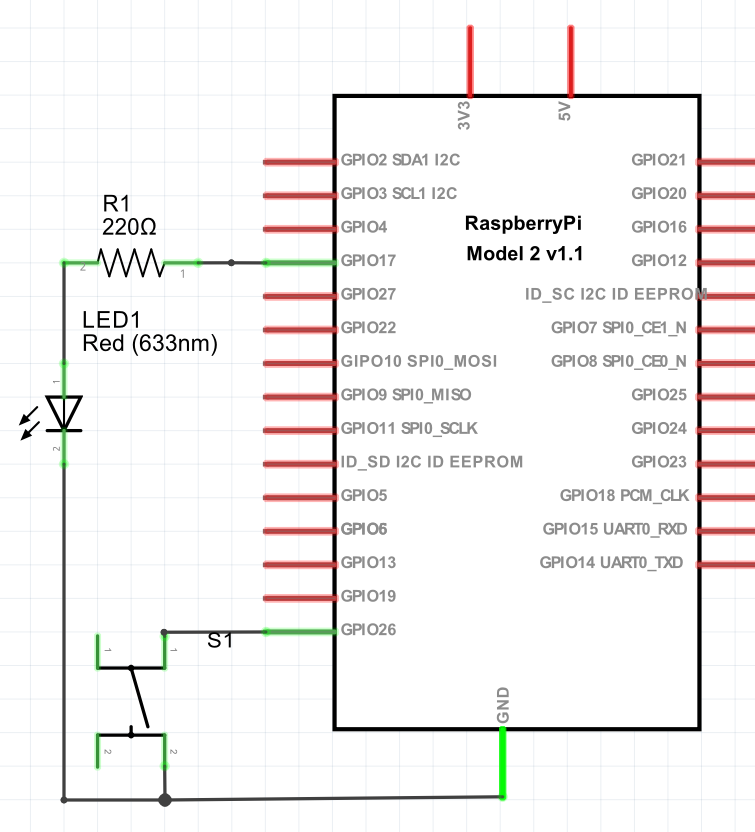
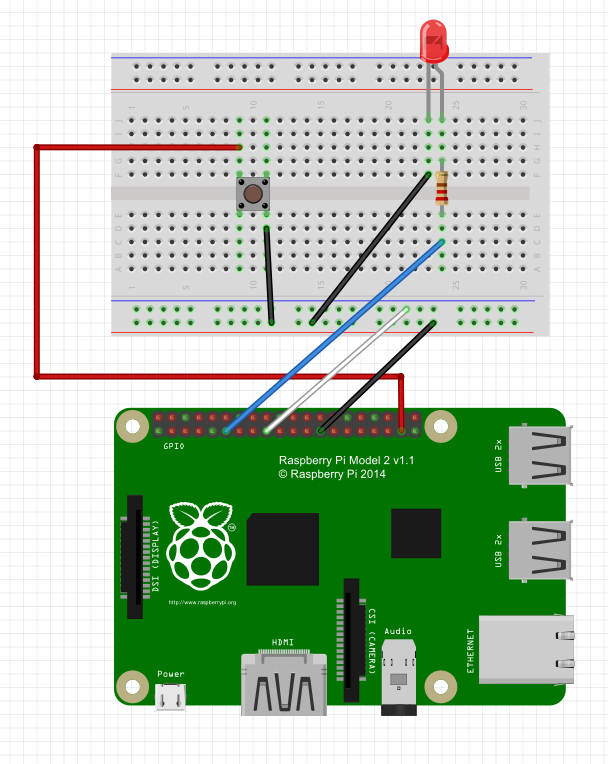

#DevCon School 2016: IoT-интенсив 

# Лабораторная 3: Hello, LED. Мигание светодиодом.


Приём сообщений с IoT Hub хорошо описан [в этой статье](https://blogs.windows.com/buildingapps/2015/12/09/windows-iot-core-and-azure-iot-hub-putting-the-i-in-iot/#XaVrtzWBatUCpe0B.97)

Вот как выглядит код для приёма сообщений из IoT Hub:

```
    EventHubClient cli = EventHubClient.CreateFromConnectionString(HubConnString, "messages/events");

    var runtimeInfo = await cli.GetRuntimeInformationAsync();
    foreach (var p in runtimeInfo.PartitionIds)
    {
        var rec = await cli.GetDefaultConsumerGroup().CreateReceiverAsync(p);
        Func<Task> f = async () =>
        {
            while (true)
            {
                var x = await rec.ReceiveAsync();
                var s = Encoding.UTF8.GetString(x.GetBytes());
                Console.WriteLine(s);
            }
        };
        f();
    }
```

Начнём с универсального приложения, созданного в предыдущей лабораторной.

## Подключаем светодиод

Для выполнения задания нам необходимо подключить к контроллеру светодиод, с использованием специальной макетной платы. 
Плата Raspberry Pi содержит некоторое количество
входов-выходов общего назначения (т.н. Gpio), которые нам нужны.


Для включения светодиода, нам нужно собрать на плате следующую принципиальную схему. Помимо светодиода, 
она содержит также и выключатель, который
нам пригодится впоследствии, а также резистор, который необходимо включить последовательно со светодиодом.



В собранном виде на макетной плате наша схема будет выглядеть так:



## Управляем светодиодом

Для управления светодиодом необходимо устанавливать соответствующий вывод (пин) контроллера в высокое или 
низкое состояние. Для работы с пинами используется класс `GpioController`, следующим образом:

```
   var Gpio = GpioController.GetDefault();
   var pin = Gpio.OpenPin(17);
   pin.SetDriveMode(GpioPinDriveMode.Output);
   pin.Write(GpioPinValue.Low);
```

## Задание

Напишите программу, которая мигает светодиодом с определённой периодичностью.

**Продвинутое задание**: Если вы хорошо разбираетесь в программировании микрокомпьютеров, попробуйте реализовать 
плавное изменение яркости светодиода с помошью технологии PWM (Pulse Width Modulation). 
Инструкции по работе с PWM на Raspberry Pi есть 
[в этой статье](http://blog.infernored.com/how-to-fade-an-led-with-pwm-in-windows-iot).
